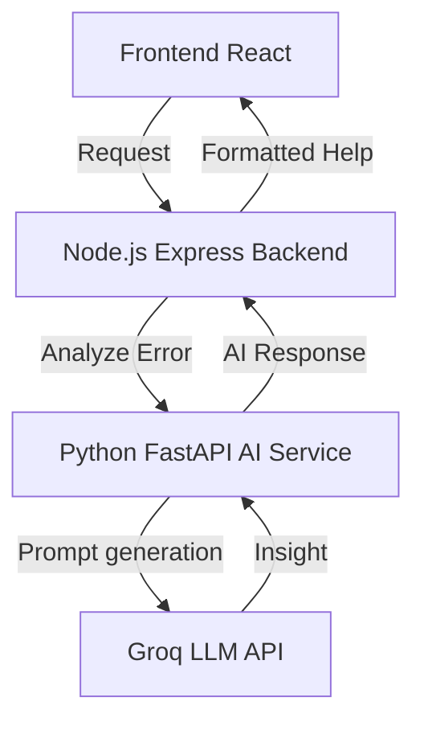
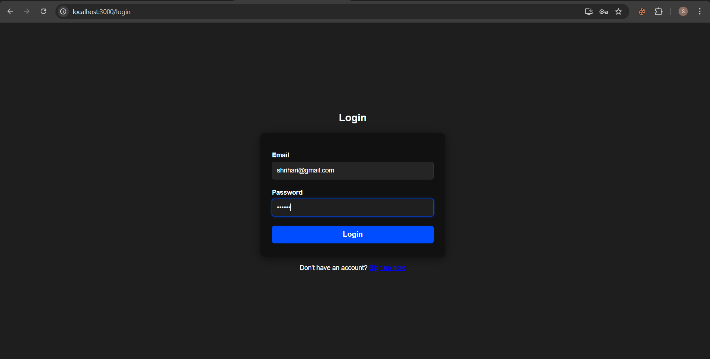
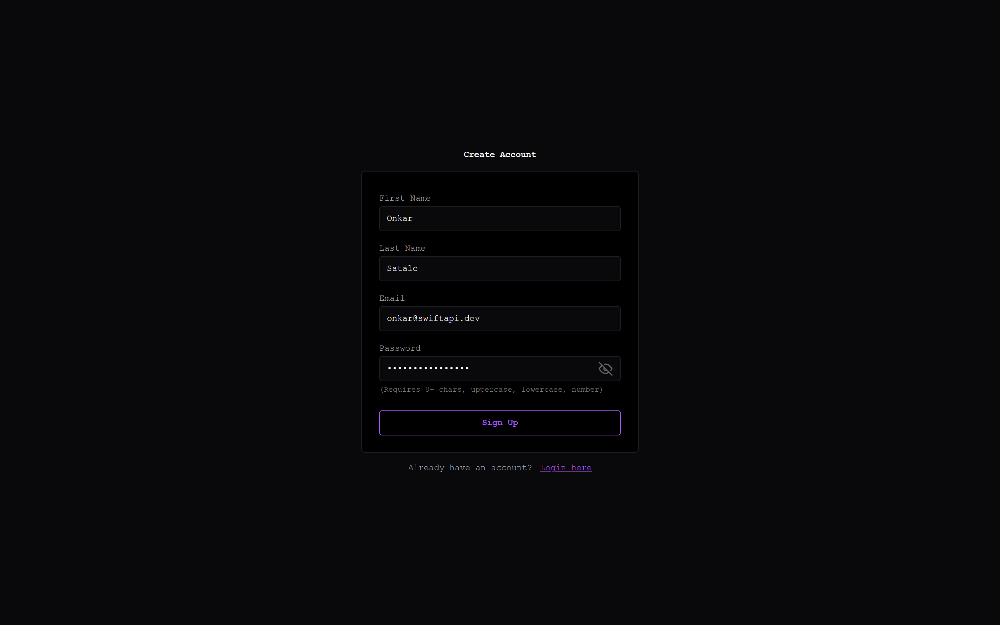
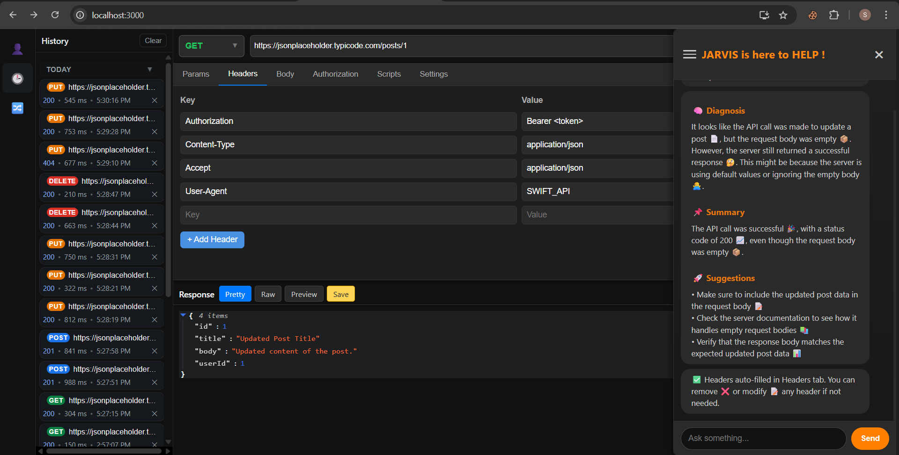
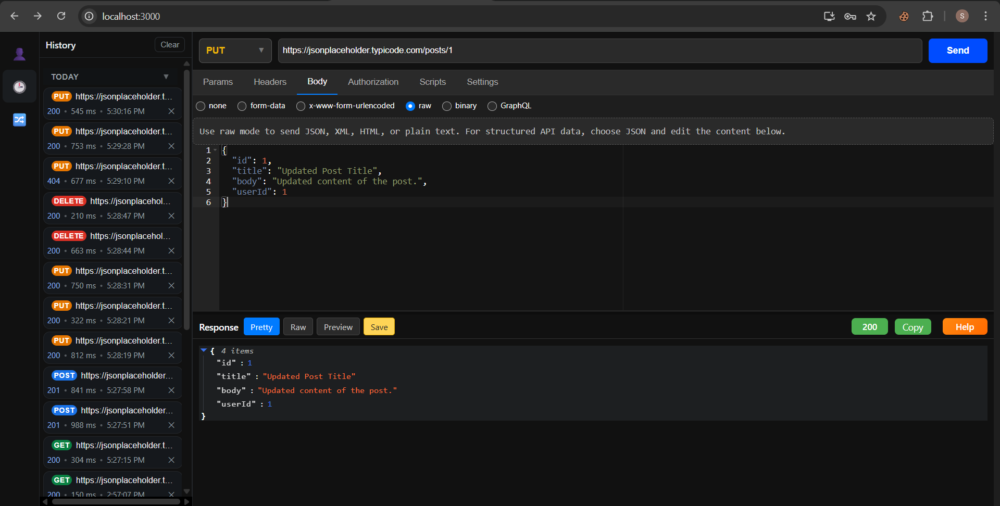
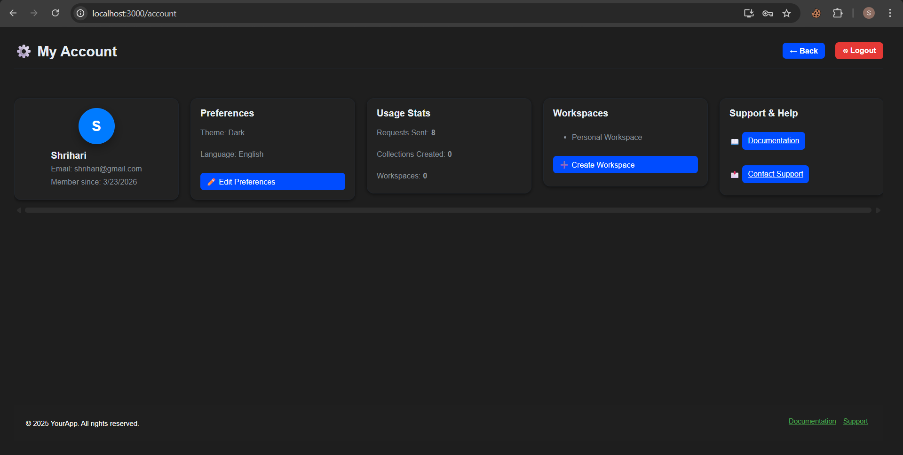
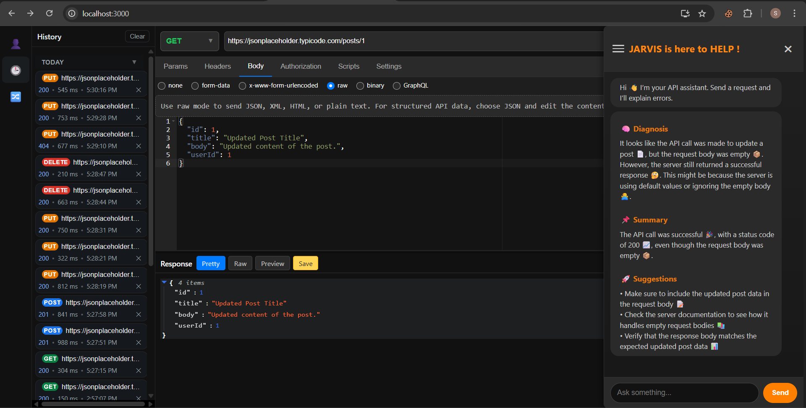

# 🚀 Swift API – Smart API Testing and Development Tool


**Swift API** is a full-stack web application designed to streamline API testing and development. 

It allows developers to send requests, view responses, manage API workflows, and now includes an **AI-powered debugging assistant** that helps identify and explain API errors. The platform combines developer productivity tools with intelligent assistance, making API development faster and easier.

---

## ✨ Features

- **📨 Send HTTP Requests:** Send API requests using `GET`, `POST`, `PUT`, `DELETE` methods with custom headers and body.
- **📚 Request History:** Automatically saves previously sent requests so developers can reuse them quickly.
- **🗂️ Collections Management:** Organize APIs into collections to structure testing workflows.
- **✨ JSON Syntax Highlighting:** Pretty formatted JSON responses for easy debugging and readability.
- **🔒 Authentication Support:** Supports JWT tokens and Bearer authentication for secured API testing.
- **🖥️ Modern Developer Interface:** Clean and responsive frontend built with React for an intuitive experience.
- **⚡ Fast Backend Architecture:** Powered by Node.js and Express.js for efficient request processing.
- **💾 Persistent Storage:** Uses MongoDB to store request history, collections, and user data.
- **👥 Multi-User Support:** Developers can register and log in securely to manage their personal API workflows.
- **🔧 Extendable Developer Tool:** The architecture is designed so developers can easily add new API testing utilities.

---

## 🤖 NEW: AI-Powered API Debugging Assistant

Swift API now includes an AI debugging assistant powered by **GenAI using the Groq API** and a **Python FastAPI backend**. This intelligent assistant helps developers quickly understand and fix API errors during testing.

### 🧠 AI Assistant Capabilities:
- **🔍 Root Cause Analysis:** Analyzes API errors and suggests the possible reason behind the failure.
- **📖 Simple Error Explanation:** Converts complex backend error messages into developer-friendly explanations.
- **🛠️ Suggested Fixes:** Provides guidance on how to resolve API issues.
- **⚡ Faster Debugging Workflow:** Reduces time spent searching documentation or StackOverflow.
- **💬 Interactive AI Help Button:** Developers can click the AI Help button when an error occurs and receive intelligent insights.

### AI Backend Architecture




---
## 📸 Screenshots

### 🔑 Login Page

*Secure login using JWT and password hashing.*

### 📝 Signup Page

*User registration page with validation.*

### 🧾 Headers / Request Configuration

*Configure headers for API requests.*

### 👁️ Testing API Requests

*Send API requests and view formatted responses.*

### 👤 Account / Profile Page

*User account page showing profile and settings.*

### 🤖 AI-Powered Debugging

*AI assistant analyzing API errors and suggesting fixes.*

---


## 🧠 Tech Stack

**Frontend**
- React, JavaScript, HTML, CSS, CSS Modules

**Backend**
- Node.js, Express.js, JWT (JSON Web Token)

**AI Service**
- Python, FastAPI, Groq API (LLM Integration)

**Database**
- MongoDB

**Development Tools**
- npm, Postman (for backend testing), VS Code

---

## ⚙️ Setup & Installation

### 1. Clone the repository
```bash
git clone https://github.com/Onkar-Satale/Swift_API_mern-.git
cd Swift_API_mern-
```

### 2. Install dependencies & Start Backend
```bash
cd backend
npm install
npm start
```
*Server will run on: `http://localhost:5000`*

### 3. Install dependencies & Start Frontend
Open a new terminal session and run:
```bash
cd Frontend
npm install
npm start
```
*Frontend will run on: `http://localhost:3000`*

### 4. Install dependencies & Start AI Service
Open a third terminal session and run the python service (ensure you set the `GROQ_API_KEY` in your `.env`):
```bash
cd ai-service
# Create a virtual environment
python -m venv venv
# Activate virtual environment
# On Windows: venv\Scripts\activate
# On Mac/Linux: source venv/bin/activate

pip install -r requirements.txt
python -m uvicorn main:app --port 8001
```
*AI Service will run on `http://127.0.0.1:8001`*

---

## 📝 Usage

1. **🖊️ Register/Login:** Sign up or log in as a developer.
2. **🔗 Enter an API endpoint:** Paste the URL you wish to test.
3. **⚙️ Select Request Method:** Choose between `GET`, `POST`, `PUT`, or `DELETE`.
4. **📦 Configure Request:** Add headers and a request body if needed.
5. **📤 Send Request:** Execute the request and view the formatted JSON response.
6. **💾 Save and Reuse:** Save the request to a collection or access it through your Request History.
7. **🤖 AI Debugging:** If an API error (e.g., 400, 500) occurs, click the **AI Assistant Help** button to get an intelligent breakdown and debugging suggestions!

---

## 🤝 Contribution

Contributions are always welcome to improve **Swift API**!

1. **Fork the repository** 🍴
2. **Create a new branch** 🌿
   ```bash
   git checkout -b feature-name
   ```
3. **Commit changes** 🛠️
   ```bash
   git commit -m "Add feature XYZ"
   ```
4. **Push changes** 🚀
   ```bash
   git push origin feature-name
   ```
5. **Open a Pull Request on GitHub** 🔃

---

## 🌐 Links & About

- **Repository:** [https://github.com/Onkar-Satale/Swift_API_mern-](https://github.com/Onkar-Satale/Swift_API_mern-)
- Frontend (Vercel): https://swift-api-iota.vercel.app/
- Backend (Render): https://swift-api-lz1n.onrender.com/
- GenAI Service (Render): https://swift-api-genai.onrender.com/

**Swift API** is designed for developers and teams to simplify API testing, debugging, and workflow management. With the integration of GenAI-powered debugging assistance, the platform goes beyond a simple Postman clone and becomes a smart developer productivity tool. It is lightweight, fast, customizable, and continuously evolving to support modern backend development workflows.

